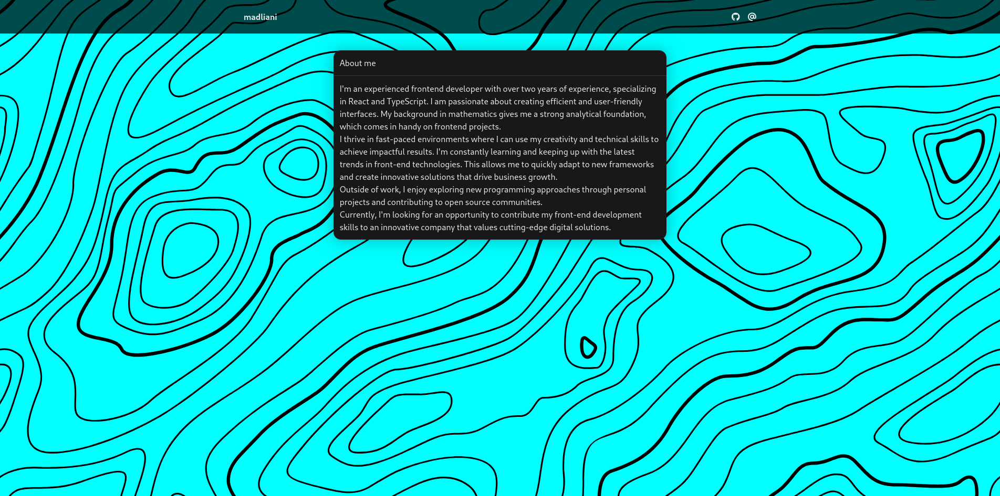

# Resume

    

    A personal website built with React and NextUI.

## Screenshots

## Usage

In the project directory, you can run:

### `yarn dev`

Runs the app in the development mode.\
Open [http://localhost:1234](http://localhost:1234) to view it in the browser.

The page will reload if you make edits.\
You will also see any lint errors in the console.

### `yarn test`

Launches the test runner in the interactive watch mode.

### `yarn build`

Builds the app for production to the `dist` folder.\
It correctly bundles React in production mode and optimizes the build for the best
performance.

The build is minified and the filenames include the hashes.\
Your app is ready to be deployed!

## Attributions

### Software Developer icon

Created by [Nilkanth Sheta](https://www.iconfinder.com/nilkanth-sheta) and licensed under [Attribution 4.0 International (CC BY 4.0)](https://creativecommons.org/licenses/by/4.0/).
